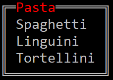

Title: Panel
Order: 0
RedirectFrom: panels
Description: "The **Panel** widget can be used to organize text into a rendered box."
Reference: T:Spectre.Console.Panel

---

The `Panel` widget can be used to organize text into a rendered box.

<?# AsciiCast cast="panel" /?>



## Usage


## Appearance

# Headers

```csharp
// Sets the header
panel.Header = new PanelHeader("Some text");
```

# Borders

For a list of borders, see the Borders appendix section.

```csharp
// Sets the border
panel.Border = BoxBorder.Ascii;
panel.Border = BoxBorder.Square;
panel.Border = BoxBorder.Rounded;
panel.Border = BoxBorder.Heavy;
panel.Border = BoxBorder.Double;
panel.Border = BoxBorder.None;
```
